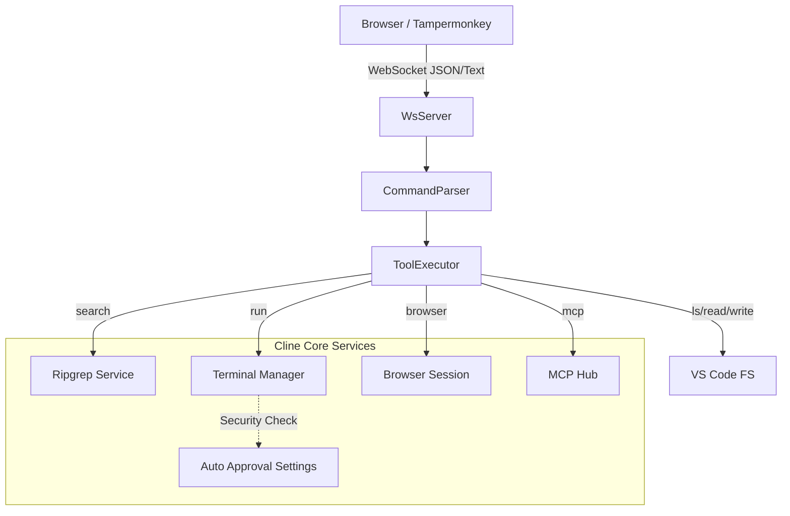

# WebSocket Bridge (ws-bridge)

The **WebSocket Bridge** enables external AI agents (such as Gemini Advanced running in a browser) to control Cline directly via a local WebSocket connection. This allows for "Headless" operation where the browser-based LLM drives the development process inside VS Code.

## 🏗 Architecture

The bridge operates as a standalone service within the Cline extension, leveraging existing core services where possible to ensure consistency and security.



### Key Components

* **`WsBridgeServer`**: Manages the WebSocket connection (default port: `3456`).
* **`CommandParser`**: Parses raw text streams into structured commands. Supports **Tool Mode** (single line) and **Block Mode** (write/edit with code blocks).
* **`ToolExecutor`**: Dispatches parsed commands to specific tool implementations.
* **`Tools`**: Individual command handlers (`RunTool`, `BrowserTool`, `SearchTool`, etc.).

---

## 🛡️ Security Model

Since the bridge operates in a "Headless" mode, it cannot display "Approve/Deny" permission prompts to the user for every action. Therefore, it relies on a **Fail-Safe** security model, particularly for the `run` command.

### Terminal Execution (`run`)

To execute terminal commands via the bridge, **ONE** of the following must be true:

1. **Global Auto-Approval**: The user has enabled **"Always approve execution of all commands"** in Cline's settings.
2. **Allowlist Match**: The command matches a pattern defined in the `CLINE_COMMAND_PERMISSIONS` environment variable (and is not explicitly denied).

**Default Behavior**: If neither condition is met, the `run` command will fail with a `Permission Denied` error.

---

## 📚 Command Reference

Commands follow the format: `command: argument`. Multiple commands can be sent in a single message (separated by newlines).

### 1. Context Gathering

| Command | Alias | Description | Example |
| --- | --- | --- | --- |
| **`ls`** | `list`, `dir` | List files/directories. | `ls: -R src/` |
| **`read`** | `cat` | Read file content. | `read: package.json` |
| **`search`** | `grep` | Search text (uses ripgrep). | `search: "TODO" src/` |

### 2. File Modification

| Command | Type | Description | Example |
| --- | --- | --- | --- |
| **`write`** | Block | Create or Overwrite file. | `write: path/to/file` <br>

<br> (followed by content block) |
| **`edit`** | Block | Search & Replace. | `edit: path/to/file` <br>

<br> (followed by SEARCH/REPLACE block) |
| **`rm`** | Tool | Delete file. | `rm: path/to/unused.file` |

### 3. System Capabilities

| Command | Description | Example |
| --- | --- | --- |
| **`run`** | Execute terminal command. <br>

<br> *Requires Auto-Approval or Allowlist.* | `run: npm install` |
| **`browser`** | Control Puppeteer browser. | `browser: navigate https://google.com` <br>

<br> `browser: click 500,300` <br>

<br> `browser: type hello` |
| **`mcp`** | Call MCP Tool. | `mcp: fetch get {"url": "..."}` |

---

## 💻 Client Setup

To connect a browser-based AI (like Google Gemini) to Cline:

1. **Install Tampermonkey**: Get the extension for your browser.
2. **Install Script**: Create a new script and paste the contents of `docs/ws-bridge/monkey.txt`.
3. **Configure Cline**:
* Go to VS Code Settings -> Cline.
* Enable `Cline > Ws Bridge: Enabled`.
* (Optional) Enable `Cline > Ws Bridge: Auto Start`.


4. **Connect**:
* Open Gemini (or supported AI chat).
* Click the "OFF" buoy in the bottom right corner to connect.
* Click "Loop Mode" to enable autonomous "Think-Execute-Observe" loops.


---

## 👨‍💻 Development Guide

### Adding a New Tool

1. **Create Tool Class**:
Create a new file in `src/services/ws-bridge/tools/MyTool.ts`. Extend `BaseTool`.
```typescript
export class MyTool extends BaseTool<MyParams> {
    static readonly Name = "my_tool"
    // ... implement execute() and parseCliArgs()
}

```


2. **Register Tool**:
Update `src/services/ws-bridge/ToolExecutor.ts`:
```typescript
const TOOL_CLASSES = {
    // ...
    my_tool: MyTool
}

```


3. **Update Parser (Optional)**:
If your tool needs aliases, update `TOOL_NAMES` in `src/services/ws-bridge/CommandParser.ts`.

### Debugging

* **VS Code Output**: All bridge logs are piped to the "Cline" output channel in VS Code.
* **Web Console**: The Tampermonkey script logs to the browser console.